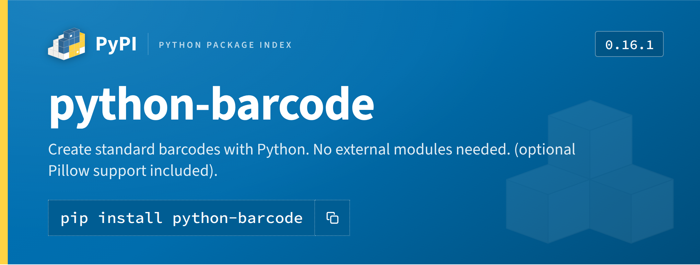
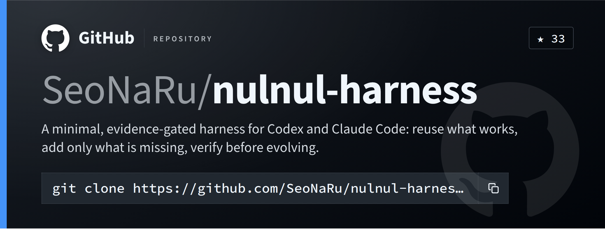

# Project card

Renders a project's own metadata into a wide banner strip: platform logo,
name, one-line summary, and the install/clone command. Not a fixed-ratio
card — the box height is intrinsic to the actual content, so a
one-sentence summary and a two-line one both render tight, with no leftover
void and no clipping.




## When to use this

Trigger on any request for a promotional/share image, card, banner, badge,
or thumbnail for **a specific PyPI package or GitHub repository**. Accept
a bare package name, a PyPI URL, a `github.com/owner/repo` URL, or an
`owner/repo` shorthand — the script auto-detects which platform from the
input shape (see `detect_platform` in `scripts/generate.py`). If the name
is unfamiliar or ambiguous (e.g. it doesn't resolve, or a GitHub profile
was named instead of a repo), resolve it before rendering rather than
guessing — a near-miss name fetches the wrong project silently. See the
`korean-law-mcp` case in this skill's own history: given a GitHub
*profile*, the right move was checking which of that user's pinned repos
actually exists on PyPI, not rendering the first guess.

## How to generate one

```bash
python3 scripts/generate.py <package>                                    # PyPI, by name
python3 scripts/generate.py https://github.com/<owner>/<repo>            # GitHub, by URL
python3 scripts/generate.py <owner>/<repo> --platform github             # GitHub, explicit
```

Always run this from inside `.claude/skills/cardstrip/` (or pass paths
relative to it) so the script's own relative asset/reference lookups
resolve. Metadata comes from each platform's own public API — PyPI's
`https://pypi.org/pypi/<package>/json`, GitHub's
`https://api.github.com/repos/<owner>/<repo>` (unauthenticated, so subject
to GitHub's public rate limit — fine for occasional use, not for batch
generation). No network access is needed for rendering itself: fonts and
logos are already bundled as data URIs.

Useful overrides, e.g. to shorten an overlong summary or pin a specific
command:

```bash
python3 scripts/generate.py <target> -o <out.png> \
  --summary "..." --chip "v2.0.0" --command "pip install '<package>[extra]'"
```

Always pass `-o` to an explicit path — the default, when omitted, is
`<name>.png` in the current working directory.

After rendering, show the image to the user (read it back / attach it) so
they can confirm it before you consider the task done. The shrink-to-fit
script keeps most names readable and an ellipsis safety-net catches the
rest, but a visual check is still the only way to catch a genuinely wrong
crop or a summary that reads oddly once clamped.

## Dependencies

Requires `playwright` (Python) and a Chromium build:

```bash
pip install playwright
```

For the browser: on a sandbox that already has one under
`/opt/pw-browsers/`, no `playwright install` is needed — `generate.py`
auto-detects it via `CHROMIUM_CANDIDATES` at the top of the script. If
neither known path exists, run `playwright install chromium` and add the
resulting path to that list (or let Playwright fall back to its default
lookup by passing no `executable_path`).

## The palette registry — reuse before you re-extract

Every colour and font this skill uses is a real design token from that
platform's own source (its CSS/design-system repo), never sampled from a
screenshot. Each platform's tokens, with full provenance, live in
`references/palette-<platform>.json`:

- `references/palette-pypi.json` — from PyPI's Warehouse sass
  (`warehouse/static/sass/settings/_colors.scss` and the blocks that paint
  the project header). Panel blue `#006dad`, Python-yellow spine `#ffd343`.
- `references/palette-github.json` — from GitHub's own Primer primitives
  (`primer/primitives`, the dark-theme base color scale and its
  `bgColor`/`fgColor`/`borderColor` functional tokens), plus the brand
  mark's official black (`#181717`, from github.com/logos via the
  simple-icons dataset). Canvas near-black `#0d1117`, accent blue `#4493f8`.

**Before generating a card for a platform that doesn't have one of these
files yet, extract its palette first** — don't invent colours or guess
from memory. Find that platform's own design-token source (a sass/CSS
variables file, a design-system primitives package, brand guideline
SVGs/hex values) the same way the two above were built, and write a new
`references/palette-<platform>.json` following this schema before writing
any template changes:

```json
{
  "platform": "npm",
  "displayName": "npm",
  "metaLabel": "SHORT CATEGORY LABEL SHOWN NEXT TO THE WORDMARK",
  "source": "where every hex below actually came from — repo + file path, not a screenshot",
  "logo": "assets/<platform>-logo.svg",
  "watermark": "assets/<platform>-logo.svg (or a dedicated glyph)",
  "colors": {
    "gradientLight": {"hex": "#xxxxxx", "token": "...", "role": "gradient light stop"},
    "base":          {"hex": "#xxxxxx", "token": "...", "role": "panel background"},
    "gradientDark":  {"hex": "#xxxxxx", "token": "...", "role": "gradient dark stop"},
    "chip":          {"hex": "#xxxxxx", "token": "...", "role": "install/clone chip background"},
    "text":          {"hex": "#xxxxxx", "token": "...", "role": "title/body text"},
    "rule":          {"hex": "#xxxxxx or rgba(...)", "token": "...", "role": "chip border / dividers"},
    "accent":        {"hex": "#xxxxxx", "token": "...", "role": "left spine accent"}
  },
  "type": {"display": "...", "mono": "...", "source": "..."}
}
```

That registry is the entire point of doing this extraction work once: the
next session (or the next platform request) reads the existing file
instead of re-deriving hex values from scratch. Once the palette file
exists, also add that platform's logo (and a watermark asset, or reuse the
logo faint) under `assets/`, and extend `detect_platform()` /
`fetch_meta_*()` in `scripts/generate.py` to recognise and fetch metadata
for it — the template itself (`assets/card_template.html`) needs no
changes; it's driven entirely by the `__COLOR_*__` and `__PLATFORM_NAME__`
/`__META_LABEL__` placeholders that `build_html()` fills from the palette
file and platform metadata.

## Layout notes (`assets/card_template.html`)

- Top row: platform logo + wordmark + a short category label (from
  `metaLabel`), a chip on the right (version for PyPI, `★ star-count` for
  GitHub).
- Name: for GitHub, rendered as `owner/` (dimmed, regular weight) +
  `repo` (bold) — mirroring how GitHub itself displays a repo header. For
  PyPI, just the package name. Shrink-to-fit runs 74px down to 36px after
  fonts load; beyond that floor, CSS `text-overflow: ellipsis` truncates
  cleanly rather than letting text bleed past the card edge (verified with
  a synthetic ~90-character `owner/repo` + a full clone URL — see this
  skill's own commit history for that render if you want to see the
  failure mode it fixes).
- Summary: the project's own one-line PyPI summary or GitHub description,
  clamped to 2 lines.
- Install/clone row: `pip install <name>` or `git clone <url>.git`, styled
  as a dotted-border chip with a copy-icon affordance (decorative only in
  the static PNG). Same ellipsis safety-net as the name.
- **Height is intrinsic** — `.card` has no fixed height; Playwright's
  element screenshot bounds itself to whatever the content actually
  renders at. Don't reintroduce a fixed height or a `space-between` flex
  gap between the summary and the install row — that's what produced the
  dead middle space this skill's strip format replaced a credit-card-ratio
  layout to fix. If you widen `.card` (currently `1080px`) or change type
  sizes, re-render a short-summary case and a long-name case together to
  confirm neither dead space nor clipping crept back in.
- Corner watermark: the platform's own mark, faint (`.085` opacity),
  bottom-right.

Edit the template directly for layout changes — it's plain HTML/CSS, no
build step. Always re-render at least three cases after a layout edit: a
short name with a one-line summary (e.g. `requests`), a long name with a
two-line summary (e.g. `opentelemetry-instrumentation-fastapi`), and a
GitHub repo (which exercises the owner-prefix title and the star chip that
PyPI cards don't have).

## Trademarks

Logos are each platform's own trademark (PyPI's is a PSF mark, GitHub's
Octocat is a GitHub mark) — use them to refer to that platform/project
itself, not to brand something else.
