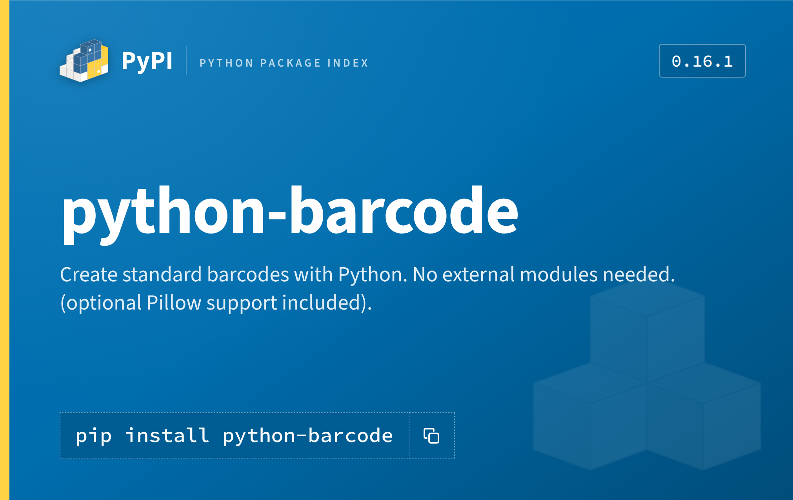

# PyPI project card

Renders `pip install <package>` project metadata into a flat panel banner
sized like a credit card (ID-1: 85.6 × 54 mm), at 2022 × 1276 px (~600 dpi,
sharp enough to print or drop straight into a README).



## When to use this

Trigger on any request for a promotional/share image, card, banner, badge,
or thumbnail for **a specific PyPI package**. If the user names a package
without a PyPI URL, assume `https://pypi.org/project/<name>/` — the script
resolves it. If they give an unfamiliar or ambiguous name, confirm the
exact PyPI project slug before rendering (a near-miss name fetches the
wrong package silently).

## How to generate one

```bash
python3 .claude/skills/pypi-card/scripts/generate.py <package> -o <out.png>
```

The script fetches live metadata from `https://pypi.org/pypi/<package>/json`
(name, version, summary) and renders `assets/card_template.html` through
Chromium via Playwright. No network access is needed for the rendering
step itself — fonts and the logo are already bundled as data URIs — only
the metadata fetch touches the network.

Useful overrides, e.g. for a pre-release or a non-default install command:

```bash
python3 .claude/skills/pypi-card/scripts/generate.py <package> \
  -o <out.png> --summary "..." --version "1.0.0rc1" --command "pip install '<package>[extra]'"
```

Always pass `-o` to an explicit path (a scratch dir or wherever the user
wants the file) — the default, when omitted, is `<package>.png` in the
current working directory.

After rendering, show the image to the user (read it back / attach it) so
they can confirm it before you consider the task done — text titles can
overflow their intended layout in ways only a visual check catches, even
though this template auto-shrinks long names to fit.

## Dependencies

Requires `playwright` (Python) and a Chromium build:

```bash
pip install playwright pillow
```

For the browser: on a sandbox that already has one under
`/opt/pw-browsers/`, no `playwright install` is needed — `generate.py`
auto-detects it via `CHROMIUM_CANDIDATES` at the top of the script. If
neither known path exists, run `playwright install chromium` and add the
resulting path to that list (or let Playwright fall back to its default
lookup by passing no `executable_path`).

## Design rationale — read `references/palette.json` before changing anything

The visual design is **not** sampled from a screenshot; every colour and
font is a real Warehouse (PyPI's codebase) design token, recorded with its
provenance in `references/palette.json`:

| Hex | Token | Role |
| --- | --- | --- |
| `#0073b7` | `+2%` lightness on `$primary-color` (site header) | gradient light stop |
| `#006dad` | `$primary-color` — the project banner itself | panel base, ~70% of the header UI |
| `#005d93` | `-5%` lightness (pip-instructions box) | install command chip |
| `#004d7a` | `$primary-color-dark` | gradient dark stop |
| `#ffffff` | `$white` | title, summary, logo |
| `rgba(255,255,255,.4)` | `$transparent-white` | dotted rules, chip borders |
| `#ffd343` | `$highlight-color` | left spine accent, echoing the logo's yellow |

Type is PyPI's too: **Source Sans 3** for display text, **Source Code
Pro** for the install command, both embedded as woff2 in `assets/fonts/`.

If you need to reproduce this for another registry (npm, crates.io, ...),
don't reuse these hex values — they are PyPI-specific. Pull that
registry's own design tokens the same way (its CSS/sass source, not a
screenshot) and record the provenance the same way in a sibling
`palette.json`, so the next run doesn't have to re-derive it.

## Layout notes (in `assets/card_template.html`)

- Top row: PyPI logo + "PyPI" wordmark + "Python Package Index" label,
  version chip right-aligned.
- Project name: shrink-to-fit from 78px down to 40px via a small JS pass
  after fonts load, so long project names never clip or overflow.
- Summary: the project's own one-line PyPI summary, clamped to 2 lines.
- Install command: styled like PyPI's own dotted-border pip-instructions
  box, with a copy-icon affordance (decorative only in the static PNG).
- A faint package-cube watermark (PyPI's own `white-cubes.svg`) sits
  bottom-right for texture without competing with the text.

Edit the template directly for layout changes — it's plain HTML/CSS, no
build step. Re-render after any edit to check text doesn't overflow at
both a short name (`requests`) and a long one
(`opentelemetry-instrumentation-fastapi`) — the shrink-to-fit script
covers the name, but the summary is still hard-clamped to 2 lines, so
extremely long summaries will be truncated silently. If that matters for
a given package, pass `--summary` with a shortened version.
