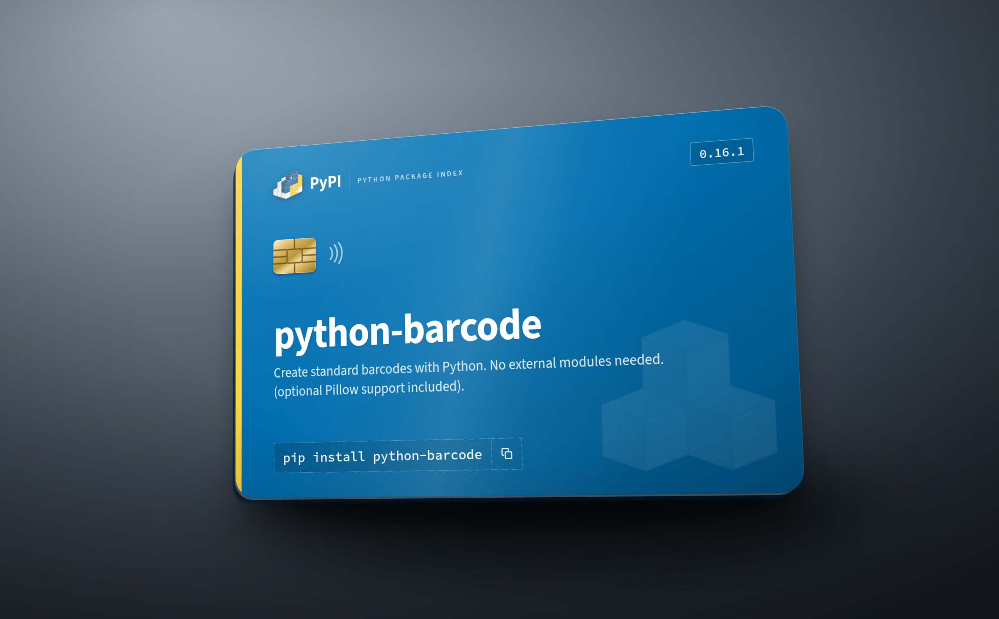

# PyPI project card

A credit-card-sized panel banner for a PyPI project, drawn with the Python
Package Index's own colours and type.


```
python3 generate.py python-barcode                 # flat panel banner
python3 generate.py python-barcode --style card    # die-cut card front, transparent corners
python3 generate.py python-barcode --style photo   # lit studio shot of the physical card
```

## Styles

| `--style` | Output | Size |
| --- | --- | --- |
| `panel` (default) | flat banner, square corners | 2022 × 1276 |
| `card` | card front die-cut to the ID-1 corner radius, transparent outside | 2022 × 1276 |
| `photo` | the card as a physical object: tilted, lit, grounded by its shadow | 2840 × 1760 |



The `card` and `photo` styles add the things that make a card read as an object
rather than a rectangle: the **3.18 mm corner radius** of ISO/IEC 7810 ID-1, an
**EMV contact chip** and contactless glyph, a bevelled edge over a white-core
sliver for the 0.76 mm thickness, a laminate specular sweep, and fine PVC grain.
`photo` puts that on a lit seamless backdrop with a skewed contact shadow.

It is a design mockup of a *package* card — no card number, expiry, issuer or
network marks, and nothing that would read as a payment instrument.

## Geometry

ID-1 / credit card: **85.6 × 54 mm**, rendered as a 1011 × 638 px board at
300 dpi and screenshotted at `device_scale_factor=2` → **2022 × 1276 px**
(≈600 dpi), so the card stays sharp when printed or dropped into a README.

## Palette

Colours are not sampled from a screenshot; they are PyPI's own design tokens,
read from `warehouse/static/sass/settings/_colors.scss` and the blocks that
paint the project header (`_banner.scss`, `_project-header.scss`,
`_site-header.scss`). `palette.json` records each role and its provenance.

| Swatch | Hex | Warehouse token | Used for |
| --- | --- | --- | --- |
| ▰ | `#0073b7` | `adjust($primary-color, +2%)` — site header | gradient light stop |
| ▰ | `#006dad` | `$primary-color` — the project banner, ~70% of the header UI | panel base |
| ▰ | `#005d93` | `adjust($primary-color, -5%)` | install command chip |
| ▰ | `#004d7a` | `$primary-color-dark` | gradient dark stop |
| ▰ | `#ffffff` | `$white` | title, summary, logo |
| ▰ | `rgba(255,255,255,.4)` | `$transparent-white` | dotted rules, chip borders |
| ▰ | `#ffd343` | `$highlight-color` | left spine, echoing the yellow in the PyPI logo |

Type is PyPI's too: **Source Sans 3** for the display text, **Source Code Pro**
for the install command (`settings/_fonts.scss`). Both are embedded as woff2
data URIs, so rendering needs no network.

## Elements (all styles)

1. **Platform** — PyPI logo + wordmark + "Python Package Index", version chip on the right.
2. **Name** — shrink-to-fit, 86 px down to 42 px, so long project names never clip.
3. **Summary** — the project's own one-liner, clamped to two lines.
4. **Install** — `pip install <name>` in the dotted-bordered chip PyPI uses, with its copy affordance.

The package cubes in the lower right are PyPI's `white-cubes.svg` at 8.5% opacity.

## Options

```
python3 generate.py <package> [-o out.png] [--summary ...] [--version ...] [--command ...]
```

Metadata comes from `https://pypi.org/pypi/<package>/json`; the overrides let you
card a pre-release, a `uv pip install` line, or a hand-written summary.

## Requirements

`pip install playwright` and a Chromium build (this repo's runner uses the one at
`/opt/pw-browsers`; otherwise `playwright install chromium`).

## Assets

* `assets/pypi-logo.svg`, `assets/white-cubes.svg` — from
  [pypi/warehouse](https://github.com/pypi/warehouse) (Apache-2.0; the PyPI logo
  is a PSF trademark — use it to refer to PyPI, not to brand something else).
* `assets/fonts/*` — Source Sans 3 and Source Code Pro, SIL Open Font License 1.1.
